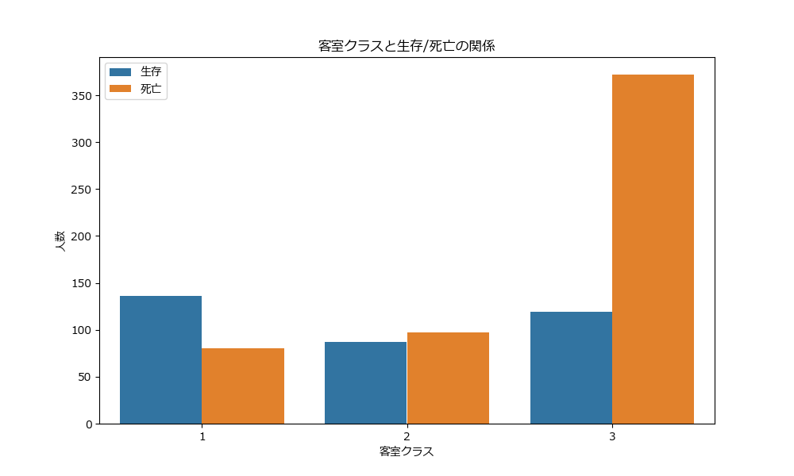

# タイタニック号の乗客生存予測分析

## 概要

本レポートでは、タイタニック号の乗客データを用いて、乗客の生存/死亡を予測するモデルを構築した。データの探索的分析、前処理、特徴量エンジニアリング、決定木モデルの構築と評価、そしてテストデータに対する予測を行った。分析の結果、性別、敬称（Title）、客室クラス（Pclass）、客室の有無（HasCabin）などが生存率に大きく影響していることが明らかになった。最適化された決定木モデルは約81.56%の精度を達成し、テストデータに対する予測を行った。

## データの探索と前処理

### データの基本情報

分析に使用するデータは、訓練データ（train.csv）とテストデータ（test.csv）の2つのファイルから構成されている。訓練データには891件の乗客情報が含まれており、テストデータには418件の乗客情報が含まれている。

訓練データには以下の変数が含まれている：

| 変数 | 定義 | 備考 |
|------|------|------|
| PassengerId | 乗客ID | 一意の識別子 |
| Perished | 死亡したかどうか | 0 = 生存, 1 = 死亡 |
| Pclass | チケットのクラス | 1 = 1st, 2 = 2nd, 3 = 3rd |
| Name | 名前 | |
| Sex | 性別 | |
| Age | 年齢 | |
| SibSp | 乗船していた兄弟姉妹・配偶者の数 | |
| Parch | 乗船していた親・子供の数 | |
| Ticket | チケット番号 | |
| Fare | チケット料金 | |
| Cabin | キャビン番号 | |
| Embarked | 乗船した港 | C = Cherbourg, Q = Queenstown, S = Southampton |

まず、訓練データの基本情報を確認するために、01_data_exploration.pyを実行したところ以下のことが分かった：

- 訓練データには891件の乗客情報が含まれている
- 目的変数（Perished）の分布は、死亡（1）が549件（61.6%）、生存（0）が342件（38.4%）
- 年齢（Age）には177件の欠損値がある
- 客室番号（Cabin）には687件の欠損値がある
- 乗船港（Embarked）には2件の欠損値がある

### データの可視化

次に、データの可視化を行い、特徴量と目的変数の関係を調べた。02_data_visualization.pyを用いてデータの可視化を行い、以下のことが明らかになった：

1. **性別と生存/死亡の関係**：女性の生存率は高く、男性の死亡率が高い。
   

2. **客室クラスと生存/死亡の関係**：1等クラス（Pclass=1）の乗客は生存率が高く、3等クラス（Pclass=3）の乗客は死亡率が高い。
   

3. **年齢と生存/死亡の関係**：子供（特に0-10歳）は生存率が高い傾向がある。
   

4. **家族サイズと生存/死亡の関係**：一人旅（家族サイズ=1）の乗客は死亡率が高く、中規模の家族（2-4人）は比較的生存率が高い傾向がある。
   

5. **数値特徴量の相関行列**：Perishedと最も相関が高い特徴量はPclass（0.34）とFare（-0.26）である。
   

### データの前処理

探索的データ分析の結果を踏まえ、03_data_preprocessing.pyを用いてデータの前処理を行った、具体的な処理は以下の通りである：

1. **欠損値の処理**：
   - 年齢（Age）は中央値で埋めた
   - 乗船港（Embarked）は最頻値で埋めた
   - 運賃（Fare）は中央値で埋めた
   - 客室番号（Cabin）は欠損が多いため、客室番号があるかどうかを示す新しい特徴量（HasCabin）を作成した

2. **カテゴリ変数のエンコーディング**：
   - 性別（Sex）を数値に変換（male: 0, female: 1）
   - 乗船港（Embarked）をOne-hotエンコーディング

3. **特徴量エンジニアリング**：
   - 家族サイズ（FamilySize）= SibSp + Parch + 1
   - 一人旅かどうか（IsAlone）
   - 年齢グループ（AgeGroup）
   - 運賃グループ（FareGroup）
   - 名前から敬称（Title）を抽出し、グループ化

4. **不要な特徴量の削除**：
   - 名前（Name）
   - チケット番号（Ticket）
   - 客室番号（Cabin）
   - 乗船港（Embarked）※One-hotエンコーディング後の元の変数

## 特徴量エンジニアリングと情報利得の計算

### 特徴量の重要度分析

前処理したデータを用いて、特徴量の重要度を分析した。04_feature_engineering.pyで決定木の特徴量重要度と相互情報量（情報利得）を計算し、以下のことが明らかになった：

1. **決定木の特徴量重要度**：
   - Title（敬称）、Fare（運賃）、Age（年齢）が最も重要な特徴量である。
   

2. **相互情報量（情報利得）**：
   - Title（敬称）、Sex（性別）、Fare（運賃）が最も重要な特徴量である。
   

3. **目的変数との相関係数**：
   - Sex（性別）、Title（敬称）、HasCabin（客室の有無）が目的変数と強い相関を持っている。
   

### 特徴量の選択

特徴量の重要度分析の結果に基づいて、以下の特徴量を選択した：

1. Title（敬称）
2. Sex（性別）
3. Fare（運賃）
4. Age（年齢）
5. Pclass（客室クラス）
6. HasCabin（客室の有無）
7. FamilySize（家族サイズ）
8. IsAlone（一人旅かどうか）
9. AgeGroup（年齢グループ）
10. FareGroup（運賃グループ）

これらの特徴量は、決定木の特徴量重要度、相互情報量、相関係数の分析結果に基づいて選択された。特に、Title（敬称）、Sex（性別）、Fare（運賃）は、すべての分析手法で重要な特徴量として特定された。

## 決定木モデルの構築と評価

### モデルの構築

特徴量の重要度分析で選択された特徴量を用いて、05_model_building.pyで決定木モデルを構築した。：`

### ハイパーパラメータのチューニング

グリッドサーチを用いて、決定木モデルのハイパーパラメータをチューニングした。以下のハイパーパラメータについて探索を行った：

- `max_depth`：決定木の最大深さ（3, 4, 5, 6, 7, 8, 10, None）
- `min_samples_split`：内部ノードを分割するために必要な最小サンプル数（2, 5, 10）
- `min_samples_leaf`：葉ノードに必要な最小サンプル数（1, 2, 4）
- `criterion`：分割の品質を測定する関数（'gini', 'entropy'）

グリッドサーチの結果、最適なハイパーパラメータは以下の通りであった：

- `criterion`: 'entropy'
- `max_depth`: 3
- `min_samples_leaf`: 1
- `min_samples_split`: 2

### モデルの評価

最適化された決定木モデルの評価結果は以下の通りである：

1. **精度（Accuracy）**：
   - 訓練データの精度：0.8531
   - バリデーションデータの精度：0.8156
   - 5分割交差検証の平均精度：0.8305

2. **混同行列（Confusion Matrix）**：
   

   混同行列から、以下のことが分かる：
   - 真陽性（True Positive）：54（生存者を正しく予測）
   - 偽陽性（False Positive）：13（死亡者を誤って生存と予測）
   - 真陰性（True Negative）：92（死亡者を正しく予測）
   - 偽陰性（False Negative）：20（生存者を誤って死亡と予測）

3. **分類レポート（Classification Report）**：
   - 生存クラスの適合率（Precision）：0.81
   - 生存クラスの再現率（Recall）：0.73
   - 生存クラスのF1スコア：0.77
   - 死亡クラスの適合率：0.82
   - 死亡クラスの再現率：0.88
   - 死亡クラスのF1スコア：0.85

4. **決定木の可視化**：
   

   決定木の可視化から、以下のことが分かる：
   - 最初の分岐点はTitle（敬称）である
   - Title <= 0.5（Mr）の場合、次の分岐点はHasCabin（客室の有無）である
   - Title > 0.5（Miss, Mrs, Master, Dr, etc.）の場合、次の分岐点はPclass（客室クラス）である

これらの評価結果から、構築した決定木モデルは約81.56%の精度でタイタニック号の乗客の生存/死亡を予測できることが分かった。また、Title（敬称）、HasCabin（客室の有無）、Pclass（客室クラス）が最も重要な分岐点であることが明らかになった。

## テストデータに対する予測と結果

### 予測結果

最適化された決定木モデルを用いて、テストデータに対する予測を行った。06_prediction.pyを実行した予測結果は以下の通りである：

- 生存者数：162人（38.76%）
- 死亡者数：256人（61.24%）

提出用のCSVファイル（titanic_predictions.csv）には、PassengerIdとPerishedの2列が含まれており、Perishedの値が1の場合は死亡、0の場合は生存を示している。

### 考察

本分析では、タイタニック号の乗客データを用いて、決定木モデルを構築し、乗客の生存/死亡を予測した。分析の結果、以下のことが明らかになった：

1. **性別（Sex）の影響**：
   - 女性の生存率は男性よりも高い
   - これは「女性と子供を優先」という避難原則が適用されたためと考えられる

2. **敬称（Title）の影響**：
   - 敬称は性別や社会的地位を反映しており、生存率に大きく影響している
   - 特に、「Mr」（成人男性）の死亡率が高く、「Miss」「Mrs」（女性）や「Master」（少年）の生存率が高い

3. **客室クラス（Pclass）の影響**：
   - 上位クラスの乗客ほど生存率が高い
   - これは上位クラスの客室が救命ボートに近い上層階にあったことや、社会的地位による優先的な避難が行われた可能性がある

4. **客室の有無（HasCabin）の影響**：
   - 客室番号が記録されている乗客（HasCabin=1）は生存率が高い
   - これは客室番号が記録されている乗客が上位クラスの乗客である可能性が高いためと考えられる

5. **年齢（Age）の影響**：
   - 子供（特に0-10歳）の生存率が高い
   - これは「女性と子供を優先」という避難原則が適用されたためと考えられる

6. **家族サイズ（FamilySize）の影響**：
   - 一人旅（家族サイズ=1）の乗客は死亡率が高い
   - 中規模の家族（2-4人）は比較的生存率が高い
   - 大家族（5人以上）は生存率が低い
   - これは、一人旅の乗客は主に成人男性であること、大家族は避難が困難であったことが理由として考えられる

これらの結果から、タイタニック号の沈没時には、性別、社会的地位、客室クラスなどの要因が生存率に大きく影響していたことが分かる。特に、「女性と子供を優先」という避難原則が適用されたことが、性別や年齢による生存率の差に反映されている。

## 結論

本分析では、タイタニック号の乗客データを用いて、決定木モデルを構築し、乗客の生存/死亡を予測した。以下に、分析の主な結論をまとめる：

1. **モデルの性能**：
   - 構築した決定木モデルは、バリデーションデータで約81.56%の精度を達成した
   - 5分割交差検証の平均精度は約83.05%であった
   - これらの結果から、モデルは比較的高い精度でタイタニック号の乗客の生存/死亡を予測できることが分かった

2. **重要な特徴量**：
   - Title（敬称）、Sex（性別）、Fare（運賃）、Pclass（客室クラス）、HasCabin（客室の有無）が最も重要な特徴量であった
   - これらの特徴量は、乗客の社会的地位や経済状況を反映しており、生存率に大きく影響していた

3. **生存要因**：
   - 女性と子供の生存率が高い（「女性と子供を優先」という避難原則の影響）
   - 上位クラスの乗客の生存率が高い（客室の位置や社会的地位の影響）
   - 客室番号が記録されている乗客の生存率が高い（上位クラスの乗客である可能性が高い）
   - 中規模の家族（2-4人）の生存率が高い（一人旅の乗客は主に成人男性、大家族は避難が困難）

4. **テストデータに対する予測**：
   - テストデータ（418件）に対する予測では、生存者数は162人（38.76%）、死亡者数は256人（61.24%）であった
   - この生存率は訓練データの生存率（38.4%）とほぼ一致しており、モデルの予測が妥当であることを示している

本分析の結果は、タイタニック号の沈没時に「女性と子供を優先」という避難原則が適用されたこと、社会的地位や経済状況が生存率に影響したことを示している。これらの知見は、歴史的な記録とも一致しており、データ分析によって過去の出来事の一側面を定量的に理解することができた。

また、機械学習の観点からは、決定木モデルが解釈可能性の高いモデルであり、重要な特徴量や分岐点を視覚的に理解できることが確認された。特に、Title（敬称）が最初の分岐点となっていることは、敬称が性別や社会的地位を反映する重要な特徴量であることを示している。

今後の課題としては、より高度なモデル（ランダムフォレストやグラディエントブースティングなど）を用いた予測精度の向上や、特徴量エンジニアリングの更なる改善が考えられる。また、生存率に影響を与えた社会的要因についても、より詳細な分析を行うことで、歴史的な出来事に対する理解を深めることができるだろう。
